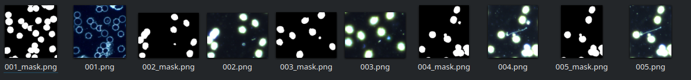

  

# Blood detection in Dark-field Microscopy Images

This dataset1 contains over 366 [dark-field microscopy](https://en.wikipedia.org/wiki/Dark-field_microscopy) images.

The data can be used to build and train an ML model that can segment blood cells.

# Structure

This repo contains the following structure:

- **images**: directory of microscopy images.
- **masks**: directory of *mask* images representing the segmented blood cells in the microscopy images. These were generated from the original masks in the dataset using a Jupyter Notebook (described below).
- **masks_orig/masks**: contains the original masks provided by the source dataset.
- **convert.ipynb**: Jupyter Notebook to convert the original masks into the format required for PerceptiLabs. Specifically, PerceptiLabs currently only supports masks with a single classification where by the background is represented as black (0) and the object(s) as white (255).
- **data.csv**: CSV file that maps microscopy images to their corresponding mask images.

  

The following shows a partial example of the data stored in **data.csv**:

| **images**  | **masks** |
|-------------|----------------------------------------|
| images/001.png | masks/001.png |
| images/002.png | masks/002.png |
| images/003.png | masks/003.png |
| images/004.png | masks/004.png |
| images/005.png | masks/005.png |
| images/006.png | masks/006.png |
| images/007.png | masks/007.png |
| images/008.png | masks/008.png |

# Community

Got questions, feedback, or want to join a community of machine learning practitioners working with exciting tools and projects? Check out our [Community](https://forum.perceptilabs.com/)!

1 Dataset Credits: https://www.kaggle.com/longnguyen2306/bacteria-detection-with-darkfield-microscopy

